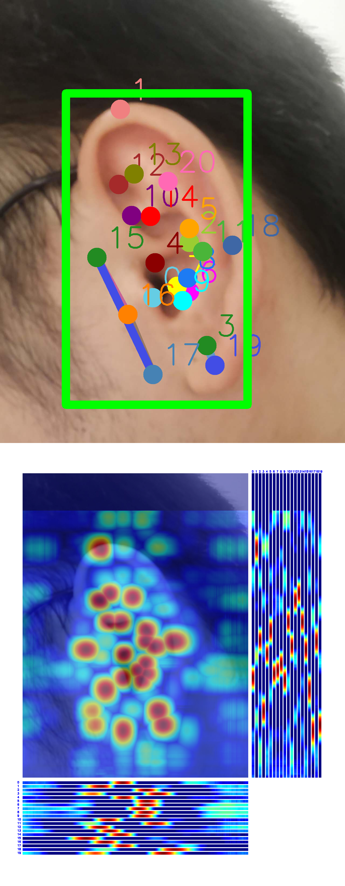

# Homework 1

[[Description]](https://github.com/open-mmlab/OpenMMLabCamp/issues/97)

[[Code Base]](https://github.com/TommyZihao/MMPose_Tutorials/tree/main/2023/0524)

[[Data]](https://drive.google.com/file/d/1zeOMs3i-1cRw6QZESp5mUwH0iozx0RZW/view?usp=drive_link)


## Environment Setup

1. Install MMdetection & MMpose
2. Move data and runing python files to the corresponding data folder


Code file organization:
```
code/
├── mmdetection/
|   ├── data/
|       ├── Ear210_Keypoint_Dataset_coco/
|       ├── rtmdet-tiny-ear.py
|   ├── ...
├── mmpose/
|   ├── data/
|       ├── Ear210_Keypoint_Dataset_coco/
|       ├── rtmpose-s-ear.py
|   ├── ...
```

## Train & Test

### Task 1: Object Detection

Run the following command to train the model:
```
cd mmdetection
python tools/train.py data/rtmdet_tiny_ear.py
```
~1 hour on RTX 4090 GPU.

Training log and model weights will be saved at `work_dirs` folder.

Run the following command to test the model:
```
python tools/test.py data/rtmdet_tiny_ear.py \
        work_dirs/rtmdet_tiny_ear/epoch_200.pth
```

### Task 2: Pose Estimation

Run the following command to train the model:
```
cd mmpose
python tools/train.py data/rtmpose_s_ear.py
```
~3 hour on RTX 4090 GPU.

Run the following command to test the model:
```
python tools/test.py data/rtmpose-s-ear.py \
        work_dirs/rtmpose-s-ear/epoch_300.pth
```


## Results

Object Detection (test on epoch_200.pth)

[homework-1/log/mmdetection_test/20230604_185806.json](log/mmdetection_test/20230604_185806.json)

```
 Average Precision  (AP) @[ IoU=0.50:0.95 | area=   all | maxDets=100 ] = 0.792
 Average Precision  (AP) @[ IoU=0.50      | area=   all | maxDets=100 ] = 0.955
 Average Precision  (AP) @[ IoU=0.75      | area=   all | maxDets=100 ] = 0.946
 Average Precision  (AP) @[ IoU=0.50:0.95 | area= small | maxDets=100 ] = -1.000
 Average Precision  (AP) @[ IoU=0.50:0.95 | area=medium | maxDets=100 ] = -1.000
 Average Precision  (AP) @[ IoU=0.50:0.95 | area= large | maxDets=100 ] = 0.792
 Average Recall     (AR) @[ IoU=0.50:0.95 | area=   all | maxDets=  1 ] = 0.831
 Average Recall     (AR) @[ IoU=0.50:0.95 | area=   all | maxDets= 10 ] = 0.840
 Average Recall     (AR) @[ IoU=0.50:0.95 | area=   all | maxDets=100 ] = 0.840
 Average Recall     (AR) @[ IoU=0.50:0.95 | area= small | maxDets=100 ] = -1.000
 Average Recall     (AR) @[ IoU=0.50:0.95 | area=medium | maxDets=100 ] = -1.000
 Average Recall     (AR) @[ IoU=0.50:0.95 | area= large | maxDets=100 ] = 0.840

{"coco/bbox_mAP": 0.792, "coco/bbox_mAP_50": 0.955, "coco/bbox_mAP_75": 0.946, "coco/bbox_mAP_s": -1.0, "coco/bbox_mAP_m": -1.0, "coco/bbox_mAP_l": 0.792, "data_time": 0.2294788360595703, "time": 0.34926186908375134}
```

Pose Estimation (test on epoch_190.pth)

[homework-1/log/mmpose_test/20230605_114516.json](log/mmpose_test/20230605_114516.json)
```
 Average Precision  (AP) @[ IoU=0.50:0.95 | area=   all | maxDets= 20 ] =  0.737
 Average Precision  (AP) @[ IoU=0.50      | area=   all | maxDets= 20 ] =  1.000
 Average Precision  (AP) @[ IoU=0.75      | area=   all | maxDets= 20 ] =  0.947
 Average Precision  (AP) @[ IoU=0.50:0.95 | area=medium | maxDets= 20 ] = -1.000
 Average Precision  (AP) @[ IoU=0.50:0.95 | area= large | maxDets= 20 ] =  0.737
 Average Recall     (AR) @[ IoU=0.50:0.95 | area=   all | maxDets= 20 ] =  0.788
 Average Recall     (AR) @[ IoU=0.50      | area=   all | maxDets= 20 ] =  1.000
 Average Recall     (AR) @[ IoU=0.75      | area=   all | maxDets= 20 ] =  0.952
 Average Recall     (AR) @[ IoU=0.50:0.95 | area=medium | maxDets= 20 ] = -1.000
 Average Recall     (AR) @[ IoU=0.50:0.95 | area= large | maxDets= 20 ] =  0.788

{"coco/AP": 0.7366519009477582, "coco/AP .5": 1.0, "coco/AP .75": 0.946852899575672, "coco/AP (M)": -1.0, "coco/AP (L)": 0.7366519009477582, "coco/AR": 0.7880952380952382, "coco/AR .5": 1.0, "coco/AR .75": 0.9523809523809523, "coco/AR (M)": -1.0, "coco/AR (L)": 0.7880952380952382, "PCK": 0.968253968253968, "AUC": 0.14523809523809525, "NME": 0.039371533729051514, "data_time": 0.8685557842254639, "time": 1.0526577234268188}
```

## Prediction Demo

### Single Image

```
# RTMDet --> RTMPose
cd mmpose

python demo/topdown_demo_with_mmdet.py \
        data/rtmdet_tiny_ear.py \
        /home/zeyuan.yin/OpenMMLabCamp/homework-1/code/mmdetection/work_dirs/rtmdet_tiny_ear/epoch_200.pth \
        data/rtmpose-s-ear.py \
        /home/zeyuan.yin/OpenMMLabCamp/homework-1/code/mmpose/work_dirs/rtmpose-s-ear/epoch_300.pth \
        --input /home/zeyuan.yin/OpenMMLabCamp/homework-1/my_ear.png \
        --output-root outputs/G2_RTMDet-RTMPose \
        --device cuda:0 \
        --bbox-thr 0.5 \
        --kpt-thr 0.5 \
        --nms-thr 0.3 \
        --radius 36 \
        --thickness 30 \
        --draw-bbox \
        --draw-heatmap \
        --show-kpt-idx
```

Results are saved in `outputs/G2_RTMDet-RTMPose/`




## Video

```
python demo/topdown_demo_with_mmdet.py \
        data/rtmdet_tiny_ear.py \
        /home/zeyuan.yin/OpenMMLabCamp/homework-1/code/mmdetection/work_dirs/rtmdet_tiny_ear/epoch_200.pth \
        data/rtmpose-s-ear.py \
        /home/zeyuan.yin/OpenMMLabCamp/homework-1/code/mmpose/work_dirs/rtmpose-s-ear/epoch_300.pth \
        --input /home/zeyuan.yin/OpenMMLabCamp/homework-1/my_ear.mp4 \
        --output-root outputs/G2_Video \
        --device cuda:0 \
        --bbox-thr 0.5 \
        --kpt-thr 0.5 \
        --nms-thr 0.3 \
        --radius 16 \
        --thickness 10 \
        --draw-bbox \
        --draw-heatmap \
        --show-kpt-idx
```

Results are saved in `outputs/G2_Video/`

<!--

 -->

<video controls style="max-width: 30%;">
  <source src="outputs/G2_Video/my_ear.mp4" type="video/mp4">
  Your browser does not support the video tag.
</video>


### Error
```
Traceback (most recent call last):
  File "demo/topdown_demo_with_mmdet.py", line 292, in <module>
    main()
  File "demo/topdown_demo_with_mmdet.py", line 265, in main
    if cv2.waitKey(5) & 0xFF == 27:
cv2.error: OpenCV(4.7.0) /io/opencv/modules/highgui/src/window.cpp:1338: error: (-2:Unspecified error) The function is not implemented. Rebuild the library with Windows, GTK+ 2.x or Cocoa support. If you are on Ubuntu or Debian, install libgtk2.0-dev and pkg-config, then re-run cmake or configure script in function 'cvWaitKey'
```

Comment out line 265-266 in `demo/topdown_demo_with_mmdet.py`
```
# if cv2.waitKey(5) & 0xFF == 27:
#     break
```