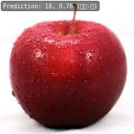

# Homework 2: Fruit classification based on ResNet50

[[Description]](https://github.com/open-mmlab/OpenMMLabCamp/issues/ )

[[Code Base]](https://github.com/open-mmlab/mmpretrain)

[[Data]](https://drive.google.com/file/d/1-6cz8pL5LNk14vXMRDNkGJMhKWJrhi8W/view?usp=sharing)

[[Video]](https://www.bilibili.com/video/BV1Ju4y1Z7ZE)

## MMPreTrain

For example, `resnet18_8xb32_in1k.py` is the config file for the `ResNet18` model, where `8xb32` means 8 GPUs and batch size 32 each, `in1k` means the model is designed on ImageNet-1K dataset. The config file is organized as follows:

```
# mmpretrain/configs/resnet/resnet18_8xb32_in1k.py

_base_ = [
    '../_base_/models/resnet18.py', '../_base_/datasets/imagenet_bs32.py',
    '../_base_/schedules/imagenet_bs256.py', '../_base_/default_runtime.py'
]
```

The four config python files are corrspoinding to the four dir/files in the `mmpretrain/configs/_base_/` folder.

```
mmpretrain/configs/_base_/
├── datasets/
├── models/
├── schedules/
├── default_runtime.py
```

## Environment Setup

1. Install MMPreTrain
2. Copy `resnet50` config files to the code/ and do some modifications
3. Why choose `resnet50_8xb32....in1k.py`? Because fruit datasets contain 30 classes which is suitable for batchsize of 32 and the resoluation of each image is around 500x500. And we have 8 candidates:

```
resnet50_8xb32-coslr_in1k.py
resnet50_8xb32-fp16-dynamic_in1k.py
resnet50_8xb32-lbs_in1k.py
resnet50_8xb32-coslr-preciseBN_in1k.py
resnet50_8xb32-fp16_in1k.py
resnet50_8xb32-mixup_in1k.py
resnet50_8xb32-cutmix_in1k.py
resnet50_8xb32_in1k.py
```

`in1k.py` is a baseline, `coslr`, `lbs` (label smooth), `mixup`, `cutmix` `preciseBN` are some tricks to improve the performance. `fp16` is a trick to speed up the training process. We simply choose `resnet50_8xb32_in1k.py` as our base config file.

Code file organization:

```
code/
├── configs/
│   ├── _base_/
|   |   ├── datasets/imagenet_bs32.py
|   |   ├── models/resnet50.py
|   |   ├── schedules/imagenet_bs256.py
|   |   ├── default_runtime.py
│   ├── resnet50_8xb32_in1k.py
├── mmpretrain/
```

## Split Dataset

train:val = 8:2

```
cd code

python split_dataset.py
```

## Train

```
mim train mmpretrain configs/resnet50_8xb32_fruit30.py --work-dir=../log/train
```

[homework-2/log/train/20230606_164304/vis_data/20230606_164304.json](log/train/20230606_164304/vis_data/20230606_164304.json)

## Test

```
mim test mmpretrain configs/resnet50_8xb32_fruit30.py --checkpoint=../log/train/epoch_100.pth --work-dir=../log/test
```

## Results

All parameters are default in `resnet50_8xb32_in1k.py` -> 60.6982%

[homework-2/log/test/20230606_170156/20230606_170156.json](log/test/20230606_170156/20230606_170156.json)

```
{"accuracy/top1": 60.69819641113281, "accuracy/top5": 91.66666412353516, "data_time": 0.0024173736572265627, "time": 0.01637766361236572}
```

Since we finetune a pretrained model, we set a smaller learning rate and do not need too many epochs.

```
lr: 0.1 -> 0.01
epochs: 100 -> 10
-----
top1: 60.6982% -> 80.2928%
```

[homework-2/log/train_lr0.01_epoch10/20230606_171745/vis_data/20230606_171745.json](log/train_lr0.01_epoch10/20230606_171745/vis_data/20230606_171745.json)

```
{"accuracy/top1": 80.29279327392578, "accuracy/top5": 96.39639282226562, "data_time": 0.003709745407104492, "time": 0.01714479923248291, "step": 10}
```

## Test on network images

<div align=left>


</div>

```python
from mmpretrain import ImageClassificationInferencer

inferencer = ImageClassificationInferencer('./configs/resnet50_8xb32_fruit30.py', pretrained='../log/train_lr0.01_epoch10/epoch_10.pth', device='cuda:0')

inferencer(['../test_img/green_apple.jpg','../test_img/red_apple.jpg'], show_dir="../test_img")

```

```
[{'pred_scores': array([3.29711050e-08, 2.58565397e-05, 2.81591014e-07, 7.11967118e-07,
         1.04445906e-04, 1.66538794e-05, 3.97861697e-07, 6.00087922e-04,
         1.60995592e-06, 2.46083516e-07, 7.46888702e-08, 1.69261602e-05,
         7.04966794e-07, 2.15075229e-08, 2.00827216e-07, 3.23365782e-07,
         3.02836306e-05, 2.49538493e-06, 4.76842943e-05, 9.98917460e-01,
         4.02113619e-06, 4.95819279e-07, 2.85665010e-07, 9.65633808e-06,
         3.08950888e-07, 1.34541108e-06, 1.86522317e-04, 1.79758899e-05,
         5.97297358e-08, 1.28730217e-05], dtype=float32),
  'pred_label': 19,
  'pred_score': 0.9989174604415894,
  'pred_class': '苹果-青'},
 {'pred_scores': array([4.61215641e-05, 6.40035083e-04, 1.20417704e-03, 2.35501509e-02,
         5.37651442e-02, 4.67822218e-04, 1.18530891e-03, 5.67966187e-03,
         2.02369466e-02, 6.93577167e-04, 2.36855689e-04, 1.75154256e-03,
         7.68452359e-04, 5.15819338e-05, 5.41449897e-03, 1.29579473e-03,
         4.44776490e-02, 3.15966026e-05, 7.78569162e-01, 4.69172234e-03,
         7.21592410e-03, 2.49086157e-03, 5.30598300e-05, 1.14459166e-04,
         3.51052295e-04, 1.63392408e-03, 4.81810467e-03, 3.78983766e-02,
         8.16523461e-05, 5.84738213e-04], dtype=float32),
  'pred_label': 18,
  'pred_score': 0.7785691618919373,
  'pred_class': '苹果-红'}]
```
