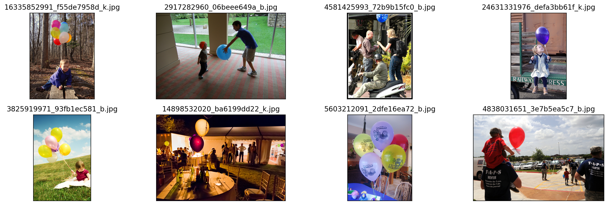
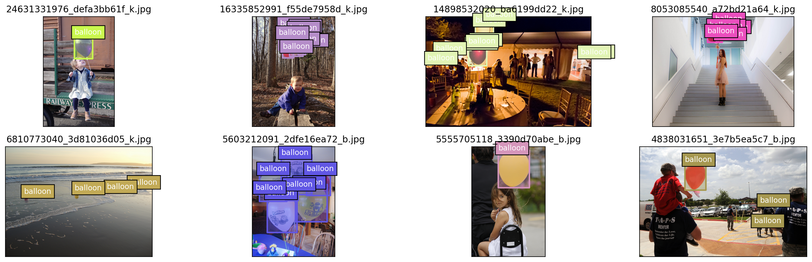
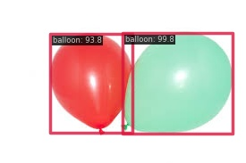
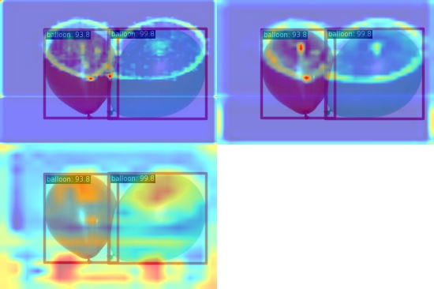
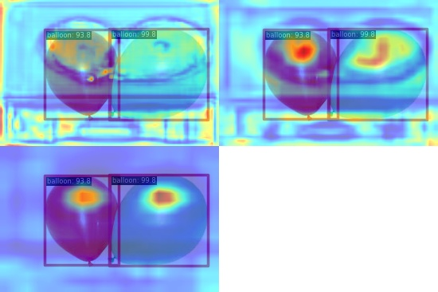
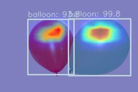
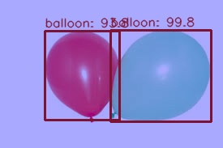

# Homework 3: Balloon detection based on RTMDet

[[Description]](https://github.com/open-mmlab/OpenMMLabCamp/issues/134)

[[Data]](https://download.openmmlab.com/mmyolo/data/balloon_dataset.zip)

[[Video][Code Base]](https://www.bilibili.com/video/BV1Ju4y1Z7ZE)


Similiar workflow as [homework 1](../homework-1/).

## Environment Setup

```
cd code

pip install -U "openmim==0.3.7"
mim install "mmengine==0.7.1"
mim install "mmcv==2.0.0"

# Install mmdetection
rm -rf mmdetection

# 为了防止后续更新导致的可能无法运行，特意新建了 tutorials 分支
git clone -b tutorials https://github.com/open-mmlab/mmdetection.git
cd mmdetection

pip install -e .
```
Code file organization:

```
code/
├── rtmdet_balloon.py
├── convert_json.py
├── mmdetection/
data/
├── balloon/
│   ├── train/
|   |   ├── via_region_data.json
|   |   ├── annotation_coco.json (generated)
|   |   ├── xxxx.jpg ...
│   ├── val/
|   |   ├── via_region_data.json
|   |   ├── annotation_coco.json (generated)
|   |   ├── xxxx.jpg ...
```

## Dataset

### Data Visualization

```
run data_vis() in vis.py
```

<div align=left>

</div>


### Annotation Visualization

For Balloon dataset, we need to convert the original json file to annotation file. And then send the annotation file to the `coco`, reference to [official readme](https://github.com/open-mmlab/mmdetection/blob/main/docs/zh_cn/user_guides/train.md#coco%E6%A0%87%E6%B3%A8%E6%A0%BC%E5%BC%8F)

```
python convert_json.py
```

```
run anno_vis() in vis.py
```

<div align=left>

</div>


## Train
```
python mmdetection/tools/train.py rtmdet_balloon.py --work-dir=../log/train
```

Outputs:
```
Average Precision  (AP) @[ IoU=0.50:0.95 | area=   all | maxDets=100 ] = 0.714
Average Precision  (AP) @[ IoU=0.50      | area=   all | maxDets=100 ] = 0.833
Average Precision  (AP) @[ IoU=0.75      | area=   all | maxDets=100 ] = 0.816
Average Precision  (AP) @[ IoU=0.50:0.95 | area= small | maxDets=100 ] = 0.000
Average Precision  (AP) @[ IoU=0.50:0.95 | area=medium | maxDets=100 ] = 0.453
Average Precision  (AP) @[ IoU=0.50:0.95 | area= large | maxDets=100 ] = 0.833
Average Recall     (AR) @[ IoU=0.50:0.95 | area=   all | maxDets=  1 ] = 0.224
Average Recall     (AR) @[ IoU=0.50:0.95 | area=   all | maxDets= 10 ] = 0.750
Average Recall     (AR) @[ IoU=0.50:0.95 | area=   all | maxDets=100 ] = 0.814
Average Recall     (AR) @[ IoU=0.50:0.95 | area= small | maxDets=100 ] = 0.000
Average Recall     (AR) @[ IoU=0.50:0.95 | area=medium | maxDets=100 ] = 0.725
Average Recall     (AR) @[ IoU=0.50:0.95 | area= large | maxDets=100 ] = 0.889
```

[homework-3/log/train/20230609_172212/vis_data/20230609_172212.json](log/train/20230609_172212/vis_data/20230609_172212.json)
```
{"coco/bbox_mAP": 0.714, "coco/bbox_mAP_50": 0.833, "coco/bbox_mAP_75": 0.816, "coco/bbox_mAP_s": 0.0, "coco/bbox_mAP_m": 0.453, "coco/bbox_mAP_l": 0.833, "data_time": 0.0045637178421020505, "time": 0.016298961639404298, "step": 40}
```

## Inference on Single Balloon Image

```
mkdir ../outputs
mkdir ../outputs/balloon_test_output

python mmdetection/demo/image_demo.py ../outputs/balloon.jpeg rtmdet_balloon.py --weights ../log/train/best_coco/bbox_mAP_epoch_40.pth --out-dir ../outputs/balloon_test_output
```

<div align=left>


</div>


## Feature Map Visualization and Box AM Visualization

Install mmyolo
```
cd code

# 为了防止后续更新导致的可能无法运行，特意新建了 tutorials 分支
!git clone -b tutorials https://github.com/open-mmlab/mmyolo.git

cd mmyolo
pip install -e .
```

### Feature Map Visualization

可视化 backbone 输出的 3 个通道

```
mkdir ../outputs/featmap_vis/
mkdir ../outputs/featmap_vis/backbone
python mmyolo/demo/featmap_vis_demo.py \
      ../outputs/balloon.jpeg \
      rtmdet_balloon.py \
      ../log/train/best_coco/bbox_mAP_epoch_40.pth  \
      --target-layers backbone  \
      --channel-reduction squeeze_mean \
      --out-dir ../outputs/featmap_vis/backbone
```


可视化 neck 输出的 3 个通道

```
mkdir ../outputs/featmap_vis/neck
python mmyolo/demo/featmap_vis_demo.py \
      ../outputs/balloon.jpeg \
      rtmdet_balloon.py \
      ../log/train/best_coco/bbox_mAP_epoch_40.pth  \
      --target-layers neck  \
      --channel-reduction squeeze_mean \
      --out-dir ../outputs/featmap_vis/neck
```

<div align=left>


</div>
左图为 backbone 输出的 3 个通道，右图为 neck 输出的 3 个通道。

### Grad-Based CAM Visualization

Due to object detection, visualization is implemented by Grad Box AM, not CAM.

Install grad-cam
```
pip install grad-cam
```

查看 neck 输出的最小输出特征图的 Grad CAM

```
mkdir ../outputs/am_vis/
mkdir ../outputs/am_vis/neck_min

python mmyolo/demo/boxam_vis_demo.py \
      ../outputs/balloon.jpeg \
      rtmdet_balloon.py \
      ../log/train/best_coco/bbox_mAP_epoch_40.pth \
      --target-layer neck.out_convs[2] \
      --out-dir ../outputs/am_vis/neck_min
```

查看 neck 输出的最大输出特征图的 Grad CAM

```
mkdir ../outputs/am_vis/neck_max

python mmyolo/demo/boxam_vis_demo.py \
      ../outputs/balloon.jpeg \
      rtmdet_balloon.py \
      ../log/train/best_coco/bbox_mAP_epoch_40.pth \
      --target-layer neck.out_convs[0] \
      --out-dir ../outputs/am_vis/neck_max
```

<div align=left>


</div>
左图为 neck 输出的最小输出特征图的 Grad CAM，右图为 neck 输出的最大输出特征图的 Grad CAM。