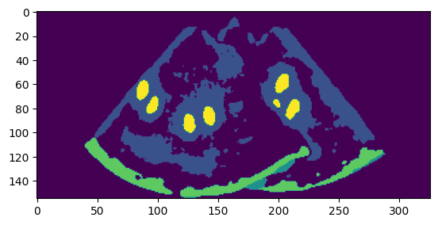
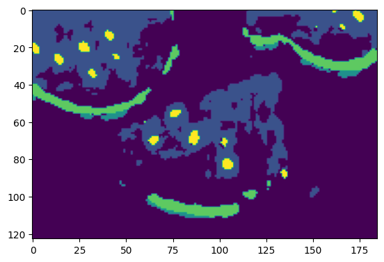
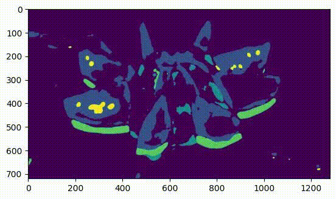

# Homework 4: Watermelon pixel-level semantic segmentation based on PSPNet

[[Description]](https://github.com/open-mmlab/OpenMMLabCamp/issues/146)

[[Data 1 (raw data)]](https://zihao-openmmlab.obs.cn-east-3.myhuaweicloud.com/20230130-mmseg/dataset/watermelon/Watermelon87_Semantic_Seg_Labelme.zip)

[[Data 2 (precessed data)]](https://zihao-openmmlab.obs.cn-east-3.myhuaweicloud.com/20230130-mmseg/dataset/watermelon/Watermelon87_Semantic_Seg_Mask.zip)

[[Code Base]](https://github.com/TommyZihao/MMSegmentation_Tutorials/tree/main/20230612/%E3%80%90C1%E3%80%91Kaggle%E5%AE%9E%E6%88%98-%E8%BF%AA%E6%8B%9C%E5%8D%AB%E6%98%9F%E8%88%AA%E6%8B%8D%E5%A4%9A%E7%B1%BB%E5%88%AB%E8%AF%AD%E4%B9%89%E5%88%86%E5%89%B2)
[[Video]]()

## Environment Setup

```
cd code

git clone https://github.com/open-mmlab/mmsegmentation.git -b dev-1.x

cd mmsegmentation
pip install -e .
```

Code file organization:

```
code/
├── configs/
│   ├── _base_/
│   │   ├── datasets/DubaiDataset_pipeline.py (downloaded)
│   │   ├── models/pspnet_r50-d8.py (moved from mmsegmentation/configs/_base_/)
│   │   ├── schedules/schedule_40k.py (moved from mmsegmentation/configs/_base_/)
│   │   ├── default_runtime.py (moved from mmsegmentation/configs/_base_/)
│   ├── pspnet/
│   │   ├── pspnet_r50-d8_4xb2-40k_DubaiDataset.py (downloaded)
├── modify_config.py
├── run.py
├── pspnet-Watermelon.py (generated by modify_config.py)
├── mmsegmentation/
│   ├── mmseg/
│   │   ├── datasets/
│   │   │   ├── __init__.py (downloaded)
│   │   │   ├── DubaiDataset.py (downloaded)
data/
├── Watermelon87_Semantic_Seg_Mask/
```

## Fix data name error

rename:
```
Watermelon87_Semantic_Seg_Mask/img_dir/train/21746.1.jpg ->  21746.jpg
/Watermelon87_Semantic_Seg_Mask/img_dir/val/01bd15599c606aa801201794e1fa30.jpg@1280w_1l_2o_100sh.jpg -> 01bd15599c606aa801201794e1fa30.jpg

```


## Config

Download the base code on Dubai dataset module under `code/mmsegmentation` folder
```
wget wget https://zihao-openmmlab.obs.cn-east-3.myhuaweicloud.com/20230130-mmseg/Dubai/pspnet_r50-d8_4xb2-40k_DubaiDatase

wget https://zihao-openmmlab.obs.cn-east-3.myhuaweicloud.com/20230130-mmseg/Dubai/__init__.py -P mmseg/datasets
```

Modify the `classes` in `DubaiDataset.py` to `'classes':['Red', 'Green', 'White', 'Seed-black', 'Seed-white', 'Unlabeled']`


Download config file under `code/` folder
```
wget https://zihao-openmmlab.obs.cn-east-3.myhuaweicloud.com/20230130-mmseg/Dubai/pspnet_r50-d8_4xb2-40k_DubaiDataset.py -P configs/pspnet
```

Look at this config file, we need to copy the `pspnet_r50-d8.py`, `default_runtime.py`, `schedule_40k.py` from mmsegmentation/configs/_base_/ to the current folder with the same structure path.

```
_base_ = [
    '../_base_/models/pspnet_r50-d8.py', '../_base_/datasets/DubaiDataset_pipeline.py',
    '../_base_/default_runtime.py', '../_base_/schedules/schedule_40k.py'
]
```


Modify the config file to fit the Watermelon dataset, add your self data address

```
python modify_config.py
```

The modified config file is saved at `pspnet-Watermelon.py`.

## Train

```
python run.py
```

Outputs:

[/homework-4/log/Watermelon/20230613_000916/vis_data/20230613_000916.json](./log/Watermelon/20230613_000916/vis_data/20230613_000916.json)
```
+------------+-------+-------+
|   Class    |  IoU  |  Acc  |
+------------+-------+-------+
|    Red     | 77.01 | 97.51 |
|   Green    | 62.36 | 64.02 |
|   White    | 30.37 | 34.29 |
| Seed-black | 61.61 | 66.84 |
| Seed-white | 63.15 | 75.08 |
| Unlabeled  | 39.81 | 52.07 |
+------------+-------+-------+
{"aAcc": 81.97, "mIoU": 55.72, "mAcc": 64.97, "data_time": 0.001296854019165039, "time": 0.08276968002319336, "step": 3000}
```

## Test

```
python mmsegmentation/tools/test.py pspnet-Watermelon.py ../log/Watermelon/iter_3000.pth --work-dir ../log/test
```
Outputs is the same as the above train outputs since we test evey 500 epoch during training.
[homework-4/log/test/20230613_002932/20230613_002932.log](./log/test/20230613_002932/20230613_002932.log)

## Inference on Watermelon Image

```
python test_img.py
```

<div align=left>


<br>


</div>


## Inference on Watermelon Video

Video Source: https://www.youtube.com/watch?v=yFPB5wct9KU


```
# Very slow

python mmsegmentation/demo/video_demo.py \
        ../test_img/watermelon.mp4 \
        pspnet-Watermelon.py \
        ../log/Watermelon/iter_3000.pth \
        --device cuda:0 \
        --output-file ../test_img/watermelon_pred.mp4 \
        --opacity 0.5
```


```
# Fast

python test_video.py
```

<div align=left>


</div>
