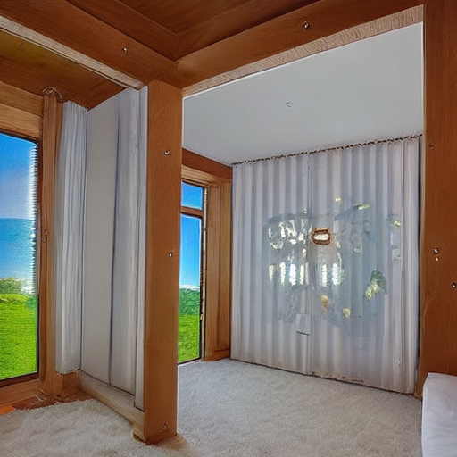

# Homework 5: N Ways to Play ControlNet

[[Description]](https://github.com/open-mmlab/OpenMMLabCamp/issues/409)
[[Code Base]](https://github.com/TommyZihao/MMagic_Tutorials)
[[Video]](https://www.bilibili.com/video/BV1gM4y1n7vP/)

Prompt: `Room with white ceiling, wooden style, a big window and beautiful scenery outside the windows.`

